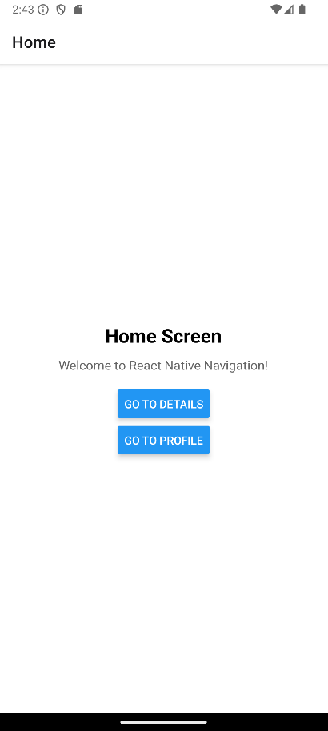
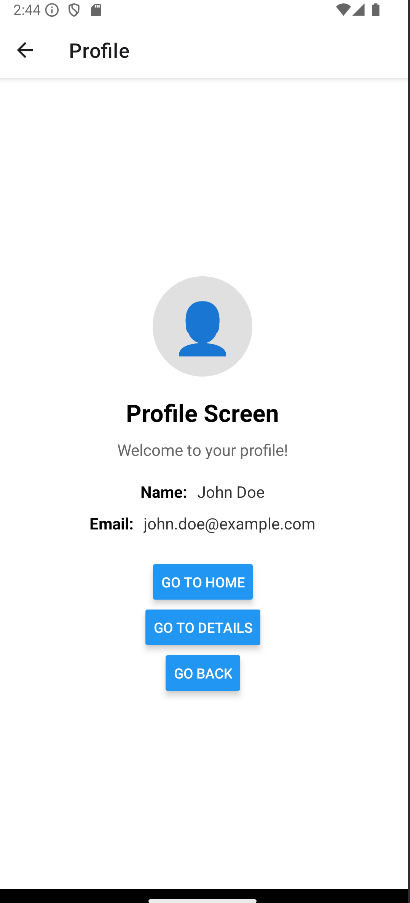

# React Native Navigation Lab Activity

A React Native application demonstrating stack navigation using React Navigation and Expo.

## Student Information
- **Name:** Jan Kendrick P. Zamudio
- **Student ID:** 202304858
- **Course:** Mobile Application Development
- **Date:** 12/02/2025

## Features
- Stack navigation between screens
- Home and Details screens
- Navigation buttons and gestures
- Android emulator support

## Technologies Used
- React Native 0.76.3
- Expo ~52.0.0
- React Navigation 6.x
- JavaScript/ES6

## Installation

\`\`\`bash
npm install
\`\`\`

## Running the App

\`\`\`bash
# Start development server
npm start

# Run on Android
npm run android

# Run on iOS
npm run ios

# Run on web
npm run web
\`\`\`

## Project Structure
\`\`\`
├── App.js                 # Main app with navigation
├── screens/
│   ├── HomeScreen.js     # Home screen
│   └── DetailsScreen.js  # Details screen
├── package.json          # Dependencies
├── app.json             # Expo configuration
└── README.md            # Documentation
\`\`\`

## Screenshots




## Challenges Faced
CHALLENGES FACED AND SOLUTIONS

## Challenge 1: Dependency Installation Issues

**Problem:** Initial installation of React Navigation dependencies resulted in version conflicts with Expo SDK.

**Solution:** Used compatible versions specified for Expo SDK 52:
```bash
npm install react-native-screens@~4.2.0 react-native-safe-area-context@~4.12.0
```

---

## Challenge 2: Navigation Not Working

**Problem:** Navigation between screens was not functioning; pressing buttons had no effect.

**Solution:** Ensured that:
1. `NavigationContainer` wraps all navigation components
2. Screen names in `navigate()` exactly match the `name` prop in `Stack.Screen`
3. The `navigation` prop is properly destructured from the component props

---

## Challenge 3: Styling Consistency

**Problem:** Screens had inconsistent styling, making the app look unprofessional.

**Solution:** Created a consistent `StyleSheet` with:
- Centered container layout using `flex: 1` and `justifyContent: 'center'`
- Uniform font sizes and colors across all screens
- Proper spacing using margin and padding

---

## Challenge 4: Adding New Screen to Navigation

**Problem:** After creating the Profile screen, it was not appearing in the navigation flow.

**Solution:** 
1. Imported the new screen in `App.js`
2. Added a new `Stack.Screen` component for the Profile route
3. Added navigation buttons in other screens to access the Profile screen


## Learning Outcomes
Upon completion of this lab activity, the following learning outcomes were achieved:

- ✅ Understanding of React Navigation library and its core concepts
- ✅ Ability to create and configure a Stack Navigator
- ✅ Knowledge of screen navigation methods (`navigate()`, `goBack()`)
- ✅ Experience with React Native styling using StyleSheet
- ✅ Familiarity with Expo development workflow
- ✅ Understanding of component-based architecture in React Native


## References
- [React Navigation Documentation](https://reactnavigation.org/)
- [Expo Documentation](https://docs.expo.dev/)
- [React Native Documentation](https://reactnative.dev/)


